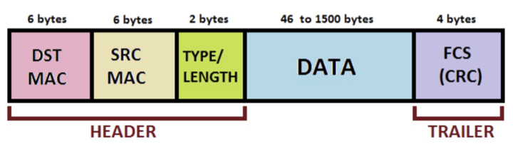

# Overview 

The goal of this assignment is to further practice computing network performance metrics based on given scenarios.

# Instructions

Answer the following questions by showing your work. You should write your responses directly in this Markdown file.

# Q1

Suppose Host A wants to send a 7 MB file to Host B. The path between Host A and Host B includes three links with the following capacities and current usage levels:

* Link 1: 1 Mbps (30% utilized)
* Link 2: 800 Kbps (10% utilized)
* Link 3: 3 Mbps (70% utilized)

Questions:

* What is the effective throughput available for the file transfer?
* Approximately how long will it take for the file to reach Host B?

```
Write your answer here!
```

# Q2

How many bits are expected to arrive with errors during the transmission of a 500 MB file, assuming a bit error rate (BER) of 10^-6?

```
Write your answer here!
```

# Q3



What is the overhead percentage of an Ethernet frame that carries 500 bytes of payload?

Refer to the Ethernet frame structure shown above. Show your work and explain your reasoning.

```
Write your answer here!
```

# Q4

A packet sent to a target host must travel through three hops, with each intermediate device introducing the following delays:

* Hop 1: 3 ms
* Hop 2: 5 ms
* Hop 3: 2 ms

What is the total end-to-end delay for the transmission?

```
Write your answer here!
```

# Q5

A router has an input queue that can hold up to 10 packets. Each packet takes 0.5 ms to be processed. If the router already has 7 packets in its input queue, what is the expected queuing delay for a newly arriving packet?

```
Write your answer here!
```

# Submission

Update your remote repository by pushing this README file. 